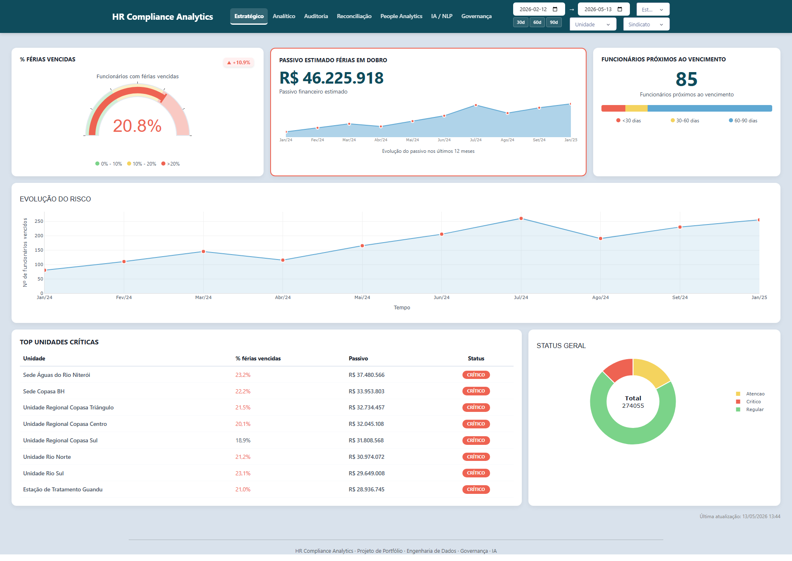
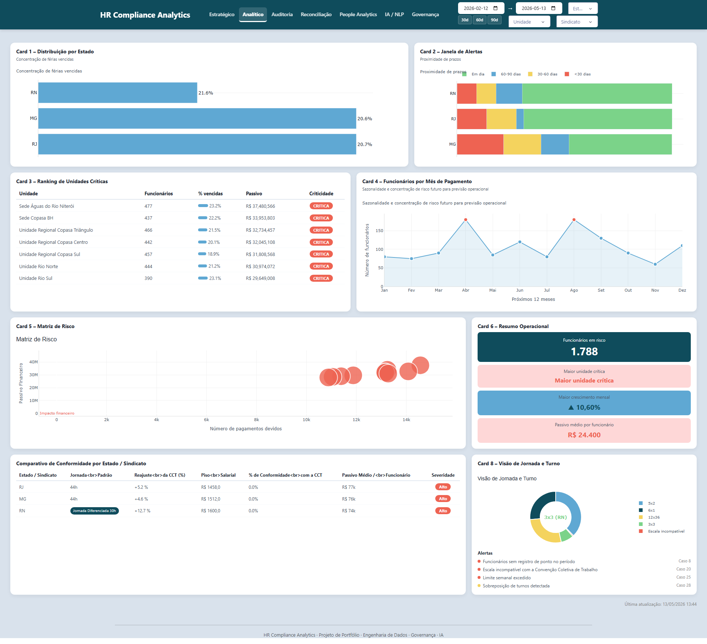
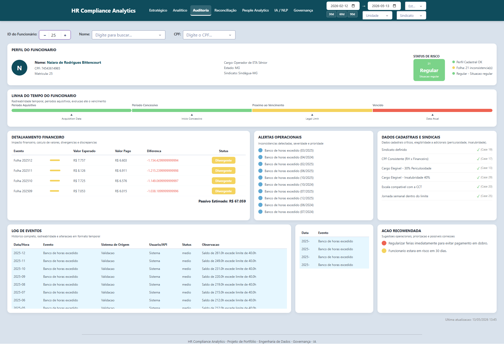
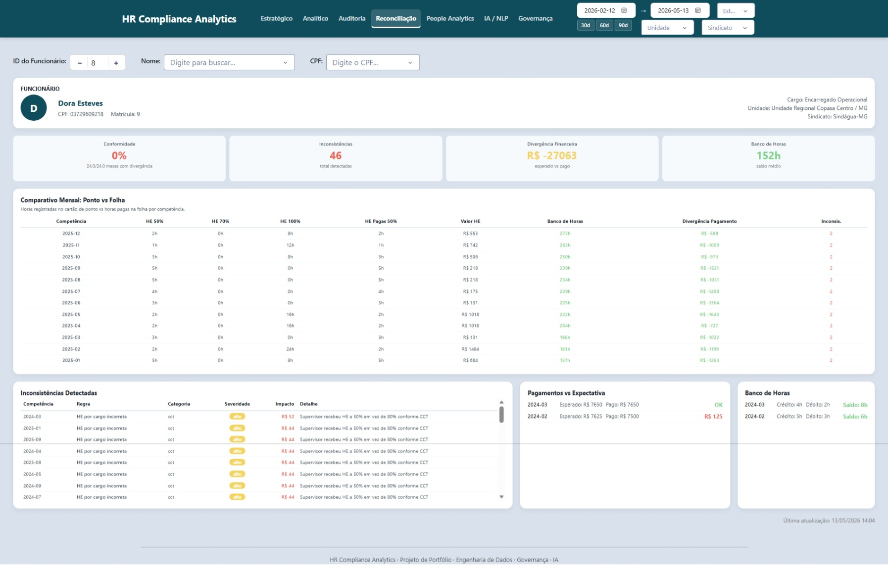
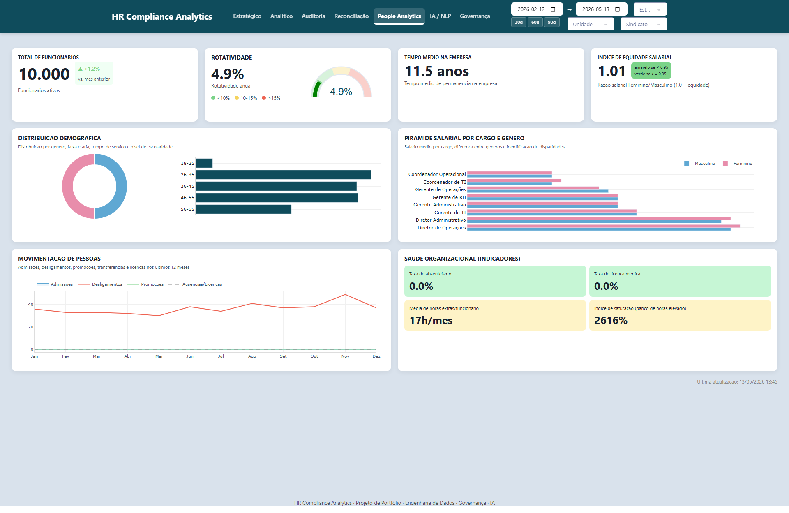
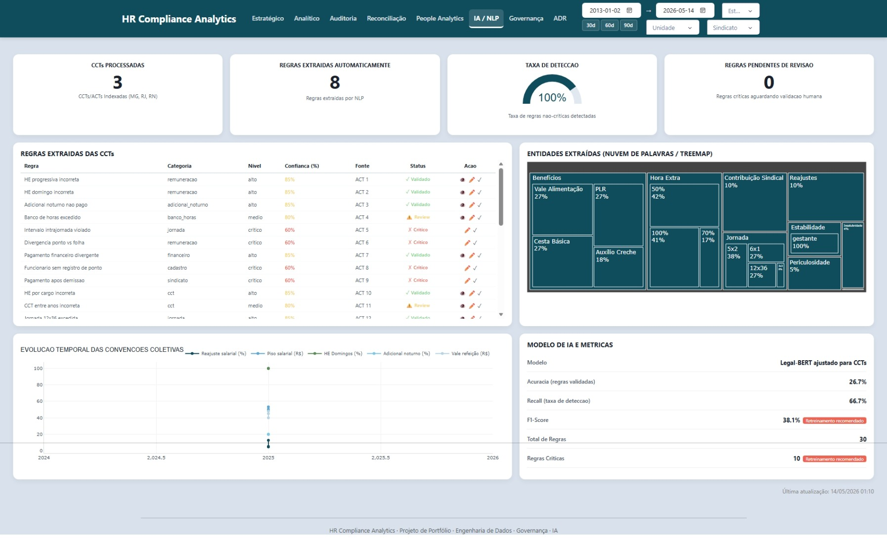
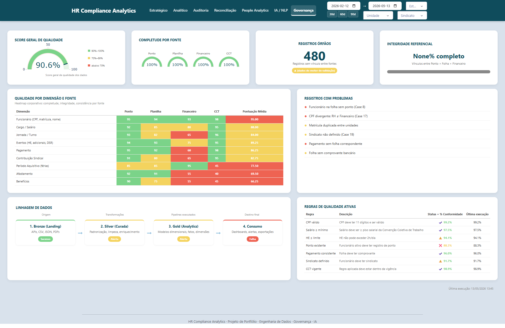

# HR Compliance Analytics
## Intelligent Labor Audit & People Analytics Platform
### Plataforma Institucional de Auditoria Trabalhista, Reconciliação de Dados e People Analytics

---

## Dashboard Preview — Pré-visualização dos Dashboards

**01 — Estratégico**



**02 — Analítico**



**03 — Auditoria Individual**



**04 — Reconciliação & Compliance**



**05 — People Analytics**



**06 — IA & NLP**



**07 — Governança & Data Quality**



---

# Documentação em Português (PT-BR)

---

## 1. Resumo Executivo

A **HR Compliance Analytics** é uma plataforma institucional de auditoria trabalhista, reconciliação de dados e people analytics, projetada para operar no setor de saneamento básico brasileiro com múltiplas realidades sindicais, regulatórias e operacionais.

A plataforma integra dados de folha de pagamento, cartão de ponto, comprovantes financeiros e Convenções Coletivas de Trabalho (CCTs/ACTs) reais, cruzando informações para detectar automaticamente inconsistências, calcular passivos trabalhistas e monitorar compliance em tempo real.

**Stakeholders principais:**
- **Diretoria e RH Executivo** — visão estratégica de risco e passivo
- **Auditoria e Compliance** — investigação, rastreabilidade e validação regulatória
- **Operações e Controladoria** — reconciliação operacional e análise financeira
- **Analistas de People Analytics** — força de trabalho, equidade e saúde organizacional

**Por que a plataforma importa:**
Em ambientes multi-sindicais e multi-estado, as regras trabalhistas divergem (jornada de 30h vs 44h, percentuais de hora extra, adicionais e pisos salariais). A plataforma elimina a validação manual, reduz riscos jurídicos e quantifica o impacto financeiro das não conformidades antes que se transformem em passivo trabalhista.

---

## 2. Visão Geral da Plataforma

A HR Compliance Analytics é um **data product** completo que vai desde a ingestão de fontes heterogêneas até a inteligência analítica de ponta, incluindo processamento de linguagem natural (NLP) aplicado a documentos jurídicos trabalhistas.

**Pilares da plataforma:**
- **Inteligência Cruzada de Ativos Trabalhistas** — reconciliação entre ponto, folha e financeiro
- **Monitoramento Regulatório e Sindical** — CCTs reais de MG, RJ e RN versionadas e aplicadas automaticamente
- **Analytics Institucional** — KPIs executivos, operacionais e de governança
- **Detecção de Risco e Passivo** — motor de 32 regras de validação com cálculo de impacto financeiro
- **Ecossistema de Dashboards** — 7 painéis especializados cobrindo estratégia, operação, auditoria, reconciliação, people analytics, IA e governança

A relação entre engenharia, modelagem, analytics e visualização é circular: os pipelines produzem dados confiáveis, o motor de validação gera inteligência de negócio, e os dashboards transformam essa inteligência em decisão executiva e operacional.

---

## 3. Arquitetura de Engenharia de Dados

A arquitetura de engenharia de dados foi projetada para simular um ambiente corporativo real de multiplas fontes, layouts variados e regras regulatórias dinâmicas.

**Ingestão e Geração Sintética (`pipelines/ingest/main.py`)**
- Geração controlada de 10 mil funcionários sintéticos com semente fixa (`random.seed`) para total reprodutibilidade
- 7 fases de geração e 32 tipos de inconsistências programadas (férias vencidas, horas extras não pagas, CPFs divergentes, pagamentos pós-demissão, etc.)
- Fontes simuladas: folha de pagamento, cartão de ponto, sistema HRIS, comprovantes financeiros

**Pipeline Bronze → Silver (`pipelines/bronze_to_silver.py`)**
- Leitura de arquivos CSV brutos (landing zone)
- Padronização de schema, casting de tipos, normalização de nomenclaturas
- Injeção de colunas de lineage (`_ingested_at`, `_source_file`)
- Persistência em Parquet com compressão Zstd para performance analítica

**Pipeline Silver → Gold (`pipelines/silver_to_gold.py`)**
- Modelagem dimensional em star schema
- Dimensão empregado com versionamento SCD2 (Slowly Changing Dimensions Tipo 2)
- Tabelas fato mensais consolidadas, fato de passivo trabalhista, banco de horas e pagamentos
- 5 tabelas de pré-agregação para consumo dos dashboards

**Motor de Validação (`pipelines/validation_engine.py`)**
- 32 regras de validação trabalhista cruzando ponto × folha × financeiro × CCT × cadastro
- Classificação por severidade (Regular, Atenção, Crítico)
- Cálculo automático de impacto financeiro por inconsistência detectada

**Governança (`pipelines/governance.py`)**
- 48 verificações automáticas de qualidade (completude, unicidade, integridade referencial, consistência, validade)
- Data catalog em JSON com 5.618 linhas de metadados
- Manifesto de lineage e auditoria de pipeline

**Orquestração**
Atualmente sequencial em scripts Python. A arquitetura suporta evolução para orquestradores tipo Dagster, Prefect ou Airflow sem alteração dos modelos de dados.

---

## 4. Arquitetura Medallion

### Bronze — Camada Bruta de Ingestão
A camada Bronze é a zona de pouso imutável. Recebe dados sintéticos em CSV e metadados em JSON, preservando o schema original e garantindo rastreabilidade total.

- **Fontes:** folha de pagamento, cartão de ponto, banco de horas, feriados, unidades, sindicatos, cargos, funcionários
- **Formato:** CSV + schema JSON + Parquet convertido
- **Características:** dados brutos, schemas preservados, timestamps de ingestão, identificação de arquivo origem
- **Exemplos:** registros de ponto diários, eventos de folha mensais, cadastros de funcionários com layout original

### Silver — Camada Curada e Harmonizada
Na Silver ocorre a limpeza, padronização e enriquecimento dos dados. Tipos são corrigidos, nulos são tratados, timestamps são alinhados e referências cruzadas são validadas.

- **Limpeza:** remoção de duplicidades, padronização de CPFs, normalização de nomes de unidades e cargos
- **Harmonização:** alinhamento de períodos entre ponto e folha, conversão de moeda/percentual, aplicação de calendário corporativo
- **Features Engineering:** cálculo de saldo de férias, idade, tempo de casa, banco de horas acumulado, flags de risco
- **Lineage:** cada registro carrega metadados de origem, pipeline e versão

### Gold — Camada Analítica de Negócio
A camada Gold contém modelos de negócio prontos para consumo analítico e dashboards.

- **Star Schema:** 7 tabelas fato + 5 dimensões + SCD2
- **Fatos:** folha de pagamento, registro de ponto, pagamentos financeiros, banco de horas, inconsistências detectadas, passivo trabalhista, movimentação de pessoas
- **Dimensões:** funcionário (SCD2), unidade, cargo, sindicato, data
- **Pré-agregações:** totais mensais por unidade, ranking de risco, evolução de passivo, conformidade por sindicato
- **Consumo:** alimenta diretamente os 7 dashboards e exportações institucionais

---

## 5. Estrutura do Projeto

```
HR Compliance Analytics/
│
├── app/                          # Aplicação Dash + Plotly (7 dashboards)
│   ├── pages/                    # Módulos de cada dashboard
│   ├── theme/                    # Cores e estilos corporativos
│   └── main.py                   # Entrypoint da aplicação
│
├── pipelines/                    # Pipelines de dados
│   ├── ingest/                   # Geração sintética de dados
│   │   └── main.py
│   ├── bronze_to_silver.py       # Curadoria e padronização
│   ├── silver_to_gold.py         # Modelagem dimensional
│   ├── validation_engine.py      # 32 regras de validação trabalhista
│   └── governance.py             # 48 checks de data quality
│
├── data/                         # Camadas Medallion
│   ├── bronze/                   # CSVs brutos e schemas
│   ├── silver/                   # Parquet curado
│   └── gold/                     # Parquet analítico + manifestos
│
├── tests/                        # Suite de testes automatizados
├── Docs/
│   ├── CCTs/                     # ACTs reais (MG, RJ, RN)
│   ├── Dashboards/               # Capturas dos 7 dashboards
│   └── architecture-decision-record.md
│
├── docker-compose.yml
├── Dockerfile
├── Makefile
└── requirements.txt
```

---

## 6. Fontes de Dados

### Dados Reais — Convenções Coletivas (CCT/ACT)
A única fonte real do projeto. Baixadas de sites oficiais de sindicatos e registradas no Ministério do Trabalho.

| Fonte | O que Fornece | Por que Importa | Consumidores |
|-------|---------------|-----------------|--------------|
| **Sindágua-MG / Copasa** | Jornada 44h, reajustes, pisos, horas extras (50%/100%), adicionais | Base regulatória para Minas Gerais | Reconciliação, Auditoria, IA/NLP |
| **Sindágua-RJ / Águas do Rio** | Jornada 44h, múltiplas concessionárias, ACTs próprias | Comparação entre empresas diferentes no mesmo estado | Analítico, Reconciliação |
| **Sindágua-RN / CAERN** | Jornada 30h (adm) / escala 3×3 (op), reajuste 12,70% | Diferencial crítico de jornada reduzida vs demais estados | Estratégico, Analítico, IA/NLP |

### Dados Sintéticos — Ambiente Corporativo Simulado
| Fonte | Descrição | Uso |
|-------|-----------|-----|
| **Folha de Pagamento** | Eventos, verbas, INSS, FGTS, IRRF, benefícios, férias, adicionais | Validação de cálculos e conformidade |
| **Cartão de Ponto** | Marcações, jornadas, escalas, horas extras, atrasos, faltas | Cruzamento com folha e CCT |
| **Sistema Financeiro** | Comprovantes de pagamento, transferências, holerites | Reconciliação de valores pagos vs calculados |
| **HRIS** | Cadastro de funcionários, cargos, unidades, sindicatos, dependentes | Integridade referencial e validação de elegibilidade |

---

## 7. Ecossistema de Dashboards

### Dashboard 01 — Estratégico
**Objetivo:** Visão executiva unificada de risco trabalhista, passivo financeiro e tendências operacionais.

**Caso de Uso Institucional:** Reuniões de diretoria, comitês de risco, avaliações trimestrais de compliance. Responde: "Qual o tamanho do problema?"

**KPIs:**
- **% Férias Vencidas:** Percentual de funcionários com férias vencidas (thresholds: <5% verde, 5-10% amarelo, >10% vermelho). Impacto direto no passivo financeiro e risco jurídico.
- **Passivo Estimado de Férias em Dobro:** Valor financeiro total projetado com base nas férias vencidas. Big number central com sparkline de evolução 12 meses.
- **Funcionários Próximos ao Vencimento:** Contagem de colaboradores a <90 dias do vencimento de férias, segmentado em <30, 30-60 e 60-90 dias. Indicador de ação preventiva.
- **Evolução de Risco (12 meses):** Gráfico de área + linha mostrando a curva de funcionários vencidos ao longo do tempo, com destaque de picos críticos.
- **Top Unidades Críticas:** Tabela ranqueada por severidade com heatmap de risco.
- **Status Geral:** Distribuição em donut chart (Regular / Próximo / Crítico).

---

### Dashboard 02 — Analítico
**Objetivo:** Visão operacional e exploratória para localização de problemas, análise regional e priorização de ações.

**Caso de Uso Institucional:** Gestores operacionais, analistas de RH e auditoria interna. Responde: "Onde estão os problemas? Quem concentra maior risco?"

**KPIs:**
- **Distribuição por Estado:** Bar chart horizontal de concentração de férias vencidas por estado, destacando o estado de maior risco com badge vermelho.
- **Alerta por Janela:** Barras empilhadas horizontais segmentadas por proximidade de vencimento, por unidade ou sindicato.
- **Ranking de Unidades Críticas:** Tabela com heatmap interno e barras de percentual vencido, passivo e severidade.
- **Funcionários por Mês de Vencimento:** Line chart de sazonalidade para os próximos 12 meses, identificando picos futuros de risco.
- **Matriz de Risco:** Scatter plot cruzando quantidade de vencimentos × passivo financeiro, com tamanho da bolha representando volume de funcionários.
- **Resumo Operacional:** Cards verticais com funcionários em risco, maior unidade crítica, maior crescimento mensal e passivo médio por funcionário.
- **Comparativo de Conformidade por Estado/Sindicato:** Tabela comparativa enterprise mostrando jornadas, reajustes ACT, pisos salariais e % de conformidade. RN (CAERN) destacado com badge "Jornada Diferenciada 30h".
- **Visão de Jornadas e Escalas:** Donut chart com distribuição de escalas (5×2, 6×1, 12×36, 3×3) + lista de alertas de incompatibilidade com CCT.

---

### Dashboard 03 — Auditoria Individual
**Objetivo:** Investigação detalhada de caso único, rastreabilidade temporal e detalhamento financeiro por funcionário.

**Caso de Uso Institucional:** Auditores trabalhistas, advogados, analistas de compliance. Responde: "O que aconteceu com este funcionário?"

**KPIs:**
- **Perfil do Funcionário:** Card horizontal com identificação completa (nome, CPF, matrícula, cargo, unidade, estado, sindicato) + badge vertical de status de risco (Regular / Atenção / Crítico).
- **Timeline Trabalhista:** Linha do tempo horizontal mostrando Período Aquisitivo → Concessivo → Próximo do Vencimento → Vencido, com marcadores de data e dias em atraso.
- **Detalhamento Financeiro:** Tabela comparativa com Valor Esperado × Valor Pago × Diferença × Status (Correto / Divergente / Crítico), com total de passivo estimado.
- **Alertas Operacionais:** Lista vertical de inconsistências detectadas com ícones de severidade (férias vencidas, pagamento parcial, pagamento pós-demissão, CPF divergente, pagamento duplicado, promoção sem reajuste, hora extra sem aprovação, adicional noturno fora da faixa, falta descontada com atestado).
- **Dados Cadastrais e Sindicais:** Checklist de validações críticas (sindicato definido, CPF consistente, cargo elegível para periculosidade/insalubridade, escala compatível com CCT, jornada dentro do limite).
- **Log de Eventos:** Tabela temporal de auditoria com timestamp, evento, sistema origem, usuário/API e status.
- **Ação Recomendada:** Card inteligente sugerindo ação corretiva priorizada (ex: "Regularizar férias imediatamente para evitar pagamento em dobro").

---

### Dashboard 04 — Reconciliação & Compliance
**Objetivo:** Motor de reconciliação cruzada entre ponto, folha, financeiro e regras da CCT. O "coração" da auditoria trabalhista.

**Caso de Uso Institucional:** Controladoria, auditoria interna, payroll. Responde: "Os números batem? A regra foi cumprida?"

**KPIs:**
- **Status Geral:** Badge gigante (Regular / Atenção / Crítico) com contagem de inconsistências encontradas.
- **Total de Horas Extras:** Comparação direta Ponto vs Folha com mini barra comparativa e diferença em horas.
- **Impacto Financeiro:** Big number da diferença estimada em reais, com alerta visual de borda vermelha quando crítico.
- **Conformidade CCT:** Progress bar horizontal com percentual de compatibilidade das regras aplicadas.
- **Reconciliação Completa:** Tabela enterprise comparando Evento × Ponto × Folha × Financeiro × Regra CCT × Resultado. Cobre hora extra, adicional noturno, banco de horas, DSR, feriado trabalhado, intervalo intrajornada, periculosidade, insalubridade, pagamento pós-demissão, HE sem aprovação, escala, benefícios.
- **Motor de Validação da CCT:** Lista estruturada de regras interpretadas com fonte da cláusula e status de conformidade.
- **Timeline de Eventos:** Fluxo sequencial Ponto Registrado → Folha Processada → Pagamento Realizado → Validação Executada → Divergência Detectada.
- **Alertas e Recomendações:** Lista de alertas detectados + cards de ação recomendada + KPIs de valor devido, risco jurídico, severidade e potencial passivo.

---

### Dashboard 05 — People Analytics
**Objetivo:** Visão holística de força de trabalho, equidade salarial, turnover e saúde organizacional.

**Caso de Uso Institucional:** RH estratégico, diversidade e inclusão, planejamento de força de trabalho. Responde: "Como está a nossa gente?"

**KPIs:**
- **Headcount Total:** Número de funcionários ativos com variação percentual vs mês anterior.
- **Turnover (Rotatividade):** Taxa anual com gauge de severidade (<10% verde, 10-15% amarelo, >15% vermelho).
- **Tempo Médio de Casa:** Média de permanência na empresa em anos.
- **Índice de Equidade Salarial:** Razão salarial feminino/masculino (1.0 = equidade). Alerta visual se <0.95.
- **Distribuição Demográfica:** Donut (gênero) + barras horizontais (faixa etária: 18-25, 26-35, 36-45, 46-55, 55+).
- **Pirâmide Salarial por Cargo e Gênero:** Bar chart horizontal agrupado identificando disparidades >10% com badge amarelo.
- **Movimentação de Pessoas:** Área + linha dos últimos 12 meses (admissões, demissões, promoções, afastamentos).
- **Saúde Organizacional:** Cards verticais com taxa de absenteísmo, taxa de afastamento médico, média de horas extras/funcionário e índice de saturação de banco de horas.

---

### Dashboard 06 — IA & NLP
**Objetivo:** Demonstrar a camada de Inteligência Artificial aplicada à interpretação automática de CCTs/ACTs em PDF.

**Caso de Uso Institucional:** Jurídico trabalhista, compliance avançado, inovação. Responde: "A IA entendeu a convenção corretamente?"

**KPIs:**
- **CCTs Processadas:** Número de convenções indexadas por estado e vigência.
- **Regras Extraídas Automaticamente:** Total de regras extraídas por NLP com variação mensal.
- **Taxa Média de Confiança:** Gauge semicircular com percentual de confiança das extrações (≥90% verde, 80-89% amarelo, <80% vermelho).
- **Regras Pendentes de Revisão:** Contagem de regras com confiança <80% aguardando validação humana.
- **Regras Extraídas da CCT:** Tabela com Regra, Entidade, Valor Extraído, Confiança, Fonte (Cláusula) e Status. Permite click para revisão do trecho PDF original.
- **Entidades Extraídas (Treemap):** Visualização de frequência de entidades por categoria (Jornada, Hora Extra, Adicional Noturno, Periculosidade, Insalubridade, Reajustes, Benefícios, Cláusulas Sociais).
- **Comparativo Histórico de Regras:** Timeline horizontal mostrando evolução de reajustes salariais, pisos, percentuais de HE e benefícios ao longo dos anos, destacando alterações com badge "ALTERAÇÃO".
- **Modelo de IA e Métricas:** Cards com arquitetura (Legal-BERT fine-tuned), Precisão, Recall, F1-Score e tempo médio de processamento por CCT.

---

### Dashboard 07 — Governança & Data Quality
**Objetivo:** Monitoramento da confiabilidade dos dados, completude das fontes, integridade referencial e linhagem.

**Caso de Uso Institucional:** Data Governance, Data Stewardship, auditoria de dados. Responde: "Os dados são confiáveis? De onde vieram?"

**KPIs:**
- **Score Geral de Qualidade:** Gauge circular com percentual geral (90-100% verde, 70-89% amarelo, <70% vermelho).
- **Completude por Fonte:** 4 mini gauges (Ponto, Folha, Financeiro, CCT).
- **Registros Órfãos:** Número de registros sem vínculo entre fontes com variação mensal.
- **Integridade Referencial:** Progress bar de chaves cruzadas entre Ponto × Folha × Financeiro.
- **Qualidade por Dimensão e Fonte:** Tabela heatmap enterprise cruzando dimensões (Funcionário, Cargo, Jornada, Eventos, Pagamento, Sindicato, Período Aquisitivo) com fontes de dados e score médio.
- **Registros com Problemas:** Lista vertical detalhando órfãos, duplicidades, inconsistências cadastrais e campos nulos críticos.
- **Data Lineage:** Diagrama de fluxo estilo DAG (Bronze → Silver → Gold → Consumo) com status de execução e metadados de pipeline.
- **Regras de Qualidade Ativas:** Tabela compacta com regra, descrição, fonte, status, última execução e % de conformidade. Exemplos: CPF válido, Salário ≥ piso, HE ≤ limite diário, Ponto existente, Pagamento consistente, Sindicato definido, CCT vigente.

---

## 8. Casos de Uso — Motor de Validação Trabalhista (32 Regras)

O motor de validação foi projetado para detectar, classificar e quantificar automaticamente as principais inconsistências trabalhistas encontradas em ambientes corporativos multi-sindicais. Abaixo estão os 32 casos de uso validados pela plataforma, organizados por categoria operacional.

### Cálculo de Horas Extras e Adicionais

| Caso | Descrição | Regra da CCT / CLT | Impacto |
|------|-----------|--------------------|---------|
| **Caso 1** | **Hora Extra Progressiva** | 1ª hora = 50%; horas adicionais = 70% | Valor não pago recalculado conforme progressão |
| **Caso 2** | **Hora Extra em Domingo** | Domingos e feriados = 100% | Diferença entre percentual aplicado e devido |
| **Caso 3** | **Adicional Noturno** | 25% entre 22h e 5h | Cálculo esperado × pago × comprovado |
| **Caso 10** | **Cargo com Regra de HE Diferente** | Analista = 50%; Supervisor = 80% | Aplicação correta por cargo conforme CCT |
| **Caso 11** | **Mudança de Regra entre Anos** | HE domingo: 80% (2023) → 100% (2024) | Aplicação temporal correta da CCT vigente |
| **Caso 14** | **DSR Calculado Incorretamente** | DSR incide sobre horas extras | Recálculo e detecção de diferença na folha |
| **Caso 15** | **Feriado Trabalhado sem Adicional** | Feriado trabalhado = 100% + folga compensatória | Valor devido não pago ou adicional omitido |
| **Caso 24** | **Adicional Noturno Aplicado Fora do Horário** | Aplicado antes das 22h ou após as 5h | Recálculo do valor correto e alerta |
| **Caso 30** | **Inconsistência Temporal de CCT** | Regra futura aplicada em competência antiga | Erro de vigência detectado e corrigido |

### Jornada, Escala e Intervalo

| Caso | Descrição | Regra da CCT / CLT | Impacto |
|------|-----------|--------------------|---------|
| **Caso 4** | **Banco de Horas Excedido** | Limite máximo de 40h acumuladas | Alerta de risco trabalhista e cálculo de excesso |
| **Caso 5** | **Intervalo Intrajornada Não Respeitado** | Mínimo de 1h para jornadas >6h | Passivo trabalhista por descanso não concedido |
| **Caso 12** | **Jornada 12×36** | Escala permitida apenas para cargos específicos | Validação de elegibilidade e cálculo de horas |
| **Caso 20** | **Escala Incompatível com Convenção** | CCT exige 5×2; funcionário registrado como 6×1 | Risco trabalhista por descumprimento de acordo |
| **Caso 25** | **Funcionário Acima do Limite Legal** | Limite semanal da CCT excedido | Consolidação semanal, cálculo de excesso e alerta crítico |
| **Caso 28** | **Jornada Sobreposta** | Duas marcações simultâneas no ponto | Detecção de erro de marcação ou fraude |

### Reconciliação Cruzada (Ponto × Folha × Financeiro)

| Caso | Descrição | Fontes Cruzadas | Impacto |
|------|-----------|-----------------|---------|
| **Caso 6** | **Divergência entre Ponto e Folha** | Ponto = 18h HE; Folha = 10h HE | Valor não pago e classificação de severidade |
| **Caso 7** | **Pagamento Financeiro Divergente** | Folha líquida = R$ 4.850; Comprovante = R$ 4.200 | Detecção de pagamento parcial ou erro bancário |
| **Caso 8** | **Funcionário sem Registro de Ponto** | Funcionário ativo na folha sem marcações | Inconsistência operacional e possível afastamento não registrado |
| **Caso 18** | **Evento Pago sem Correspondência** | Pagamento de adicional sem evento na folha | Erro operacional ou lançamento indevido |
| **Caso 21** | **Pagamento Duplicado** | Mesmo evento pago 2× no mesmo período | Impacto financeiro e alerta de duplicidade |
| **Caso 26** | **Divergência entre Sindicato e CCT Aplicada** | Funcionário no sindicato A; folha aplica regras do sindicato B | Aplicação incorreta de convenção coletiva |

### Adicionais e Benefícios

| Caso | Descrição | Regra da CCT / CLT | Impacto |
|------|-----------|--------------------|---------|
| **Caso 13** | **Adicional de Periculosidade** | Cargo elegível exige 30% | Validação de aplicação na folha e no pagamento |
| **Caso 16** | **Banco de Horas Negativo Indevido** | Saldo negativo acima do limite da CCT | Alerta de abuso operacional |
| **Caso 22** | **Hora Extra sem Aprovação** | Política exige aprovação acima de 2h extras/dia | Alerta operacional e risco de invalidação |
| **Caso 29** | **Adicional de Insalubridade Ausente** | Cargo elegível obriga aplicação de 40% | Cálculo de impacto financeiro não pago |

### Cadastro, Carreira e Consistência de Dados

| Caso | Descrição | Validação | Impacto |
|------|-----------|-----------|---------|
| **Caso 9** | **Funcionário Recebendo após Demissão** | Data de demissão × pagamentos posteriores | Alerta crítico de pagamento indevido |
| **Caso 17** | **Funcionário com CPF Divergente** | CPF do RH ≠ CPF do financeiro | Impossibilita reconciliação automática |
| **Caso 19** | **Funcionário sem Sindicato Definido** | Campo sindicato nulo ou inválido | Impede aplicação automática da CCT correta |
| **Caso 23** | **Promoção sem Atualização Salarial** | Cargo alterado sem reajuste correspondente | Inconsistência de carreira e cálculo de diferença |
| **Caso 27** | **Falta Descontada Incorretamente** | Atestado médico válido × desconto na folha | Detecção de desconto indevido |

### Férias e Passivo Trabalhista

| Caso | Descrição | Regra da CCT / CLT | Impacto |
|------|-----------|--------------------|---------|
| **Caso 31** | **Férias Vencidas não Gozadas** | Período aquisitivo venceu sem gozo registrado | Cálculo de passivo (dobro do valor) |
| **Caso 32** | **Alerta Preventivo de Vencimento de Férias** | Funcionário próximo do fim do período concessivo sem agendamento | Alerta com 60, 30 e 15 dias de antecedência para ação preventiva |

---

## 9. Framework de KPIs

O framework de KPIs foi arquitetado como um **sistema de decisão institucional** com 4 categorias principais:

1. **KPIs de Risco Trabalhista** — férias vencidas, proximidade de vencimento, passivo estimado, severidade por unidade
2. **KPIs de Compliance Financeiro** — divergência ponto/folha, impacto financeiro, conformidade CCT, pagamentos incorretos
3. **KPIs de People Analytics** — turnover, equidade salarial, absenteísmo, movimentação, saúde organizacional
4. **KPIs de Governança de Dados** — score de qualidade, completude, integridade referencial, registros órfãos

**Mecanismos analíticos:**
- **Rolling Calculations:** janelas móveis de 3, 6 e 12 meses para tendências
- **Scoring de Severidade:** algoritmo ponderado por volume, impacto financeiro e criticidade regulatória
- **Classificação de Regime de Risco:** Regular / Atenção / Crítico com thresholds dinâmicos por sindicato
- **Overlays Sindicais:** todos os KPIs financeiros e de jornada são contextualizados pela CCT vigente do estado/sindicato

---

## 10. Estratégia de Visualização e UX

A interface foi intencionalmente projetada para parecer uma **plataforma corporativa de monitoramento de risco**, com estética inspirada em terminais analíticos empresariais.

- **Tema corporativo:** Azul petróleo (`#0F4C5C`) como cor institucional, cinza claro (`#D9E2EC`) como fundo, criando contraste executivo sem fadiga visual
- **Densidade analítica:** layouts grid-based com múltiplas visões simultâneas, priorizando leitura rápida
- **Hierarquia visual:** Big numbers no topo, tabelas detalhadas na base, gráficos de tendência no meio
- **Código de cores consistente:** Verde (`#7BD389`) = Regular/OK, Amarelo (`#F4D35E`) = Atenção, Vermelho (`#EE6352`) = Crítico/Divergente, Azul claro (`#5FA8D3`) = Informação/Primário
- **Navegação global:** Header fixo com menu horizontal e filtros globais (Ano, Mês, Estado, Unidade, Sindicato) aplicáveis a todos os dashboards
- **Responsividade:** Componentes Bootstrap com breakpoints adaptáveis para análise em estações de trabalho e apresentações executivas

**Por que este design:** Em ambientes de alta criticidade (como auditoria trabalhista), a velocidade de leitura e a consistência visual reduzem erros humanos e aceleram a tomada de decisão.

---

## 11. Design do Sistema

```
┌─────────────────────────────────────────────────────────────────────────┐
│                           FONTES DE DADOS                               │
│  ┌──────────────┐ ┌──────────────┐ ┌──────────────┐ ┌──────────────┐   │
│  │ Folha (CSV)  │ │ Ponto (CSV)  │ │ Financeiro   │ │ CCTs/ACTs    │   │
│  │  (sintético) │ │  (sintético) │ │   (sintético)│ │   (PDF real) │   │
│  └──────┬───────┘ └──────┬───────┘ └──────┬───────┘ └──────┬───────┘   │
└─────────┼────────────────┼────────────────┼────────────────┼───────────┘
          │                │                │                │
          ▼                ▼                ▼                ▼
┌─────────────────────────────────────────────────────────────────────────┐
│                         INGESTÃO (pipelines/ingest)                     │
│              Geração sintética controlada com sementes fixas            │
└─────────────────────────────────────────────────────────────────────────┘
          │
          ▼
┌─────────────────────────────────────────────────────────────────────────┐
│                         BRONZE (data/bronze)                            │
│              Landing imutável — CSV + Schema JSON + Parquet             │
└─────────────────────────────────────────────────────────────────────────┘
          │
          ▼
┌─────────────────────────────────────────────────────────────────────────┐
│                    SILVER (pipelines/bronze_to_silver)                  │
│         Limpeza, normalização, type casting, lineage, harmonização      │
└─────────────────────────────────────────────────────────────────────────┘
          │
          ▼
┌─────────────────────────────────────────────────────────────────────────┐
│                      GOLD (pipelines/silver_to_gold)                    │
│   Star Schema: 7 facts + 5 dims + SCD2 + pré-agregações analíticas      │
└─────────────────────────────────────────────────────────────────────────┘
          │
          ▼
┌─────────────────────────────────────────────────────────────────────────┐
│              MOTOR DE VALIDAÇÃO (pipelines/validation_engine)           │
│              32 regras trabalhistas × impacto financeiro                │
└─────────────────────────────────────────────────────────────────────────┘
          │
          ▼
┌─────────────────────────────────────────────────────────────────────────┐
│              GOVERNANÇA (pipelines/governance)                          │
│              48 checks de qualidade + catalog + lineage                 │
└─────────────────────────────────────────────────────────────────────────┘
          │
          ▼
┌─────────────────────────────────────────────────────────────────────────┐
│                         CAMADA DE DASHBOARDS (app/)                     │
│   Estratégico │ Analítico │ Auditoria │ Reconciliação │ People │ IA │ Gov │
└─────────────────────────────────────────────────────────────────────────┘
          │
          ▼
┌─────────────────────────────────────────────────────────────────────────┐
│                           USUÁRIO FINAL                                 │
│       Executivo │ Auditor │ Analista │ Controladoria │ Jurídico        │
└─────────────────────────────────────────────────────────────────────────┘
```

---

## 12. Stack Tecnológico

| Categoria | Tecnologias |
|-----------|-------------|
| **Engenharia de Dados** | Python 3.11+, Pandas, DuckDB (OLAP in-process), SQL |
| **Armazenamento & Formato** | Parquet (Zstd), CSV (bronze), JSON (governance/catalog) |
| **Visualização & Frontend** | Dash, Plotly, dash-bootstrap-components |
| **Modelagem Analítica** | Star Schema, SCD2, Fatos mensais, Dimensões corporativas |
| **Qualidade & Governança** | Regras SQL/Pandas, JSON Catalog, Data Lineage, Manifestos de auditoria |
| **IA / NLP** | Extração de entidades, classificação de regras, interpretação de CCTs |
| **Infraestrutura** | Docker, Docker Compose, Makefile (local), planejado: GCP/AWS |
| **Testes** | pytest, testes de contrato e integridade |

---

## 13. Como Executar

**Local (desenvolvimento)**
```bash
# 1. Instalar dependências
pip install -r requirements.txt

# 2. Executar pipelines de dados
python pipelines/run_pipeline.py

# ou executar etapa a etapa
python pipelines/ingest/main.py
python pipelines/bronze_to_silver.py
python pipelines/silver_to_gold.py
python pipelines/validation_engine.py
python pipelines/governance.py

# 3. Iniciar dashboards
python app/main.py
# → Acesse http://localhost:8050

# 4. Executar testes
python -m pytest tests/ -v
```

**Docker (produção local)**
```bash
# Build e inicialização (gera dados automaticamente na primeira execução)
docker compose up -d
# → Acesse http://localhost:8050

# Executar pipeline dentro do container
docker compose run --rm app pipeline

# Executar testes dentro do container
docker compose run --rm app test

# Encerrar
docker compose down
```

**Atalhos Makefile**
```bash
make dev          # servidor de desenvolvimento local
make pipeline     # pipeline completo de dados
make test         # suite de testes
make docker-build # build da imagem Docker
make docker-up    # inicialização via Docker
```

**Responsabilidade de cada script de pipeline**
- `pipelines/ingest/main.py`: gera os dados sintéticos (camada bronze)
- `pipelines/bronze_to_silver.py`: padroniza e cura dados da bronze para silver
- `pipelines/silver_to_gold.py`: modela camada analítica (gold)
- `pipelines/validation_engine.py`: executa as regras trabalhistas de validação
- `pipelines/governance.py`: executa checks de qualidade e governança
- `pipelines/run_pipeline.py`: orquestra todas as etapas acima em sequência

---

## 14. Impacto de Negócio

- **Aceleração de Decisões:** Diretoria visualiza risco e passivo em segundos, não em semanas de relatórios manuais
- **Monitoramento Institucional:** Compliance contínuo com CCTs reais, reduzindo exposição jurídica
- **Consciência Regulatória:** Visão clara das diferenças entre sindicatos e estados (ex: jornada 30h RN vs 44h MG/RJ)
- **Detecção de Volatilidade Operacional:** Picos de vencimentos e inconsistências são identificados antes de virarem crises
- **Monitoramento de Liquidez de Pessoas:** Previsão de turnover, movimentação e concentração de expertise
- **Inteligência Operacional:** Reconciliação automática entre sistemas que, na prática corporativa, nunca conversam diretamente
- **Suporte à Decisão Executiva:** Quantificação financeira do risco trabalhista para provisionamento e planejamento estratégico

---

## 15. Extensibilidade

A plataforma foi arquitetada para evolução modular:

- **Streaming em Tempo Real:** Substituição da ingestão batch por Kafka/Kinesis para marcações de ponto em tempo real
- **Orquestração Avançada:** Migração para Dagster/Prefect/Airflow com DAGs monitoradas, retries e backfill
- **Machine Learning:** Modelos preditivos de turnover, forecast de passivo trabalhista e detecção anômala de pagamentos
- **Anomaly Detection:** Algoritmos estatísticos para identificar padrões de fraude e erros sistêmicos
- **Forecasting Engines:** Projeção de passivo futuro com base em cenários de admissão/demissão e inflação salarial
- **Alertas Institucionais:** Integração com Slack, Email e PagerDuty para notificações de criticidade
- **Cloud Deployment:** Deploy em GCP (BigQuery + Cloud Run) ou AWS (Redshift + ECS) com processamento distribuído
- **Otimização de Portfólio de Pessoas:** Aplicação de técnicas quantitativas de otimização na alocação de equipes por unidade e projeto

---

---

# Documentation in English (EN)

---

## 1. Executive Summary

**HR Compliance Analytics** is an institutional labor audit, data reconciliation, and people analytics platform designed to operate in the Brazilian basic sanitation sector with multiple union, regulatory, and operational realities.

The platform integrates payroll, time-clock, financial proof, and real Collective Bargaining Agreements (CBAs/ACTs), cross-referencing information to automatically detect inconsistencies, calculate labor liabilities, and monitor compliance in real time.

**Primary stakeholders:**
- **C-Suite & Executive HR** — strategic risk and liability view
- **Audit & Compliance** — investigation, traceability, and regulatory validation
- **Operations & Controllership** — operational reconciliation and financial analysis
- **People Analytics Analysts** — workforce, equity, and organizational health

**Why the platform matters:**
In multi-union and multi-state environments, labor rules diverge (30h vs 44h workweeks, overtime percentages, hazard pay, minimum wages). The platform eliminates manual validation, reduces legal risk, and quantifies the financial impact of non-conformities before they become labor liabilities.

---

## 2. Platform Overview

HR Compliance Analytics is a complete **data product** ranging from heterogeneous source ingestion to cutting-edge analytical intelligence, including Natural Language Processing (NLP) applied to labor legal documents.

**Platform pillars:**
- **Cross-Asset Labor Intelligence** — reconciliation between time-clock, payroll, and finance
- **Regulatory & Union Monitoring** — real CBAs from MG, RJ, and RN versioned and automatically applied
- **Institutional Analytics** — executive, operational, and governance KPIs
- **Risk & Liability Detection** — 32-rule validation engine with financial impact calculation
- **Dashboard Ecosystem** — 7 specialized panels covering strategy, operations, audit, reconciliation, people analytics, AI, and governance

The relationship between engineering, modeling, analytics, and visualization is circular: pipelines produce trustworthy data, the validation engine generates business intelligence, and dashboards transform that intelligence into executive and operational decisions.

---

## 3. Data Engineering Architecture

The data engineering architecture was designed to simulate a real corporate environment of multiple sources, varying layouts, and dynamic regulatory rules.

**Ingestion & Synthetic Generation (`pipelines/ingest/main.py`)**
- Controlled generation of 10,000 synthetic employees with fixed seed (`random.seed`) for full reproducibility
- 7 generation phases and 32 programmed inconsistency types (expired vacations, unpaid overtime, divergent CPFs, post-termination payments, etc.)
- Simulated sources: payroll, time-clock, HRIS, financial proofs

**Bronze → Silver Pipeline (`pipelines/bronze_to_silver.py`)**
- Reading of raw CSV files (landing zone)
- Schema standardization, type casting, nomenclature normalization
- Lineage column injection (`_ingested_at`, `_source_file`)
- Persistence in Parquet with Zstd compression for analytical performance

**Silver → Gold Pipeline (`pipelines/silver_to_gold.py`)**
- Dimensional modeling in star schema
- Employee dimension with SCD2 (Slowly Changing Dimensions Type 2) versioning
- Monthly consolidated fact tables, labor liability fact, hour bank and payment facts
- 5 pre-aggregation tables for dashboard consumption

**Validation Engine (`pipelines/validation_engine.py`)**
- 32 labor validation rules crossing time-clock × payroll × finance × CBA × registry
- Severity classification (Regular, Attention, Critical)
- Automatic financial impact calculation per detected inconsistency

**Governance (`pipelines/governance.py`)**
- 48 automated quality checks (completeness, uniqueness, referential integrity, consistency, validity)
- JSON data catalog with 5,618 lines of metadata
- Lineage manifest and pipeline audit trail

**Orchestration**
Currently sequential Python scripts. The architecture supports evolution to Dagster, Prefect, or Airflow without changing data models.

---

## 4. Medallion Architecture

### Bronze — Raw Ingestion Layer
The Bronze layer is the immutable landing zone. It receives synthetic data in CSV and metadata in JSON, preserving the original schema and ensuring total traceability.

- **Sources:** payroll, time-clock, hour bank, holidays, units, unions, positions, employees
- **Format:** CSV + JSON schema + converted Parquet
- **Characteristics:** raw data, preserved schemas, ingestion timestamps, source file identification
- **Examples:** daily time-clock records, monthly payroll events, employee registries in original layout

### Silver — Curated & Harmonized Layer
Silver is where cleaning, standardization, and enrichment occur. Types are corrected, nulls are handled, timestamps are aligned, and cross-references are validated.

- **Cleaning:** duplicate removal, CPF standardization, unit and position name normalization
- **Harmonization:** period alignment between time-clock and payroll, currency/percentage conversion, corporate calendar application
- **Feature Engineering:** vacation balance calculation, age, tenure, accumulated hour bank, risk flags
- **Lineage:** each record carries origin, pipeline, and version metadata

### Gold — Business-Ready Analytical Layer
The Gold layer contains business models ready for analytical consumption and dashboards.

- **Star Schema:** 7 fact tables + 5 dimensions + SCD2
- **Facts:** payroll, time-clock, financial payments, hour bank, detected inconsistencies, labor liability, people movement
- **Dimensions:** employee (SCD2), unit, position, union, date
- **Pre-aggregations:** monthly totals by unit, risk ranking, liability evolution, compliance by union
- **Consumption:** directly feeds all 7 dashboards and institutional exports

---

## 5. Project Structure

```
HR Compliance Analytics/
│
├── app/                          # Dash + Plotly application (7 dashboards)
│   ├── pages/                    # Dashboard modules
│   ├── theme/                    # Corporate colors and styles
│   └── main.py                   # Application entrypoint
│
├── pipelines/                    # Data pipelines
│   ├── ingest/                   # Synthetic data generation
│   │   └── main.py
│   ├── bronze_to_silver.py       # Curation and standardization
│   ├── silver_to_gold.py         # Dimensional modeling
│   ├── validation_engine.py      # 32 labor validation rules
│   └── governance.py             # 48 data quality checks
│
├── data/                         # Medallion layers
│   ├── bronze/                   # Raw CSVs and schemas
│   ├── silver/                   # Curated Parquet
│   └── gold/                     # Analytical Parquet + manifests
│
├── tests/                        # Automated test suite
├── Docs/
│   ├── CCTs/                     # Real ACTs (MG, RJ, RN)
│   ├── Dashboards/               # 7 dashboard screenshots
│   └── architecture-decision-record.md
│
├── docker-compose.yml
├── Dockerfile
├── Makefile
└── requirements.txt
```

---

## 6. Data Sources

### Real Data — Collective Bargaining Agreements (CBA/ACT)
The only real source in the project. Downloaded from official union websites and registered with the Ministry of Labor.

| Source | What It Provides | Why It Matters | Consumers |
|--------|------------------|----------------|-----------|
| **Sindágua-MG / Copasa** | 44h week, adjustments, minimum wages, overtime (50%/100%), add-ons | Regulatory baseline for Minas Gerais | Reconciliation, Audit, AI/NLP |
| **Sindágua-RJ / Águas do Rio** | 44h week, multiple concessionaires, proprietary ACTs | Comparison between different companies in the same state | Analytical, Reconciliation |
| **Sindágua-RN / CAERN** | 30h (admin) / 3×3 shift (ops), 12.70% adjustment | Critical differential of reduced hours vs other states | Strategic, Analytical, AI/NLP |

### Synthetic Data — Simulated Corporate Environment
| Source | Description | Usage |
|--------|-------------|-------|
| **Payroll** | Events, earnings, INSS, FGTS, IRRF, benefits, vacations, add-ons | Calculation and compliance validation |
| **Time-Clock** | Clock-in/out, shifts, overtime, tardiness, absences | Cross-check with payroll and CBA |
| **Financial System** | Payment receipts, transfers, payslips | Reconciliation of paid vs calculated amounts |
| **HRIS** | Employee registry, positions, units, unions, dependents | Referential integrity and eligibility validation |

---

## 7. Dashboard Ecosystem

### Dashboard 01 — Strategic
**Objective:** Unified executive view of labor risk, financial liability, and operational trends.

**Institutional Use Case:** Board meetings, risk committees, quarterly compliance assessments. Answers: "How big is the problem?"

**KPIs:**
- **% Expired Vacations:** Percentage of employees with expired vacation (thresholds: <5% green, 5-10% yellow, >10% red). Direct impact on financial liability and legal risk.
- **Estimated Double Vacation Liability:** Total projected financial value based on expired vacations. Central big number with 12-month sparkline.
- **Employees Near Expiration:** Count of employees <90 days from vacation expiration, segmented into <30, 30-60, and 60-90 days. Preventive action indicator.
- **Risk Evolution (12 months):** Area + line chart showing the curve of expired employees over time, with critical peak highlights.
- **Top Critical Units:** Ranked table with risk heatmap.
- **Overall Status:** Distribution in donut chart (Regular / Near / Critical).

---

### Dashboard 02 — Analytical
**Objective:** Operational and exploratory view for problem location, regional analysis, and action prioritization.

**Institutional Use Case:** Operational managers, HR analysts, internal audit. Answers: "Where are the problems? Who concentrates the highest risk?"

**KPIs:**
- **Distribution by State:** Horizontal bar chart of expired vacation concentration by state, highlighting the highest-risk state with a red badge.
- **Window Alert:** Stacked horizontal bars segmented by expiration proximity, by unit or union.
- **Critical Units Ranking:** Table with internal heatmap and percentage bars, liability, and severity.
- **Employees by Expiration Month:** Line chart of seasonality for the next 12 months, identifying future risk peaks.
- **Risk Matrix:** Scatter plot crossing number of expirations × financial liability, with bubble size representing employee volume.
- **Operational Summary:** Vertical cards with employees at risk, largest critical unit, highest monthly growth, and average liability per employee.
- **Compliance Comparison by State/Union:** Enterprise comparative table showing shifts, ACT adjustments, minimum wages, and compliance %. RN (CAERN) highlighted with "Differentiated 30h Shift" badge.
- **Shift & Schedule View:** Donut chart with shift distribution (5×2, 6×1, 12×36, 3×3) + alert list of CBA incompatibility.

---

### Dashboard 03 — Individual Audit
**Objective:** Detailed case investigation, temporal traceability, and per-employee financial breakdown.

**Institutional Use Case:** Labor auditors, lawyers, compliance analysts. Answers: "What happened to this employee?"

**KPIs:**
- **Employee Profile:** Horizontal card with full identification (name, CPF, ID, position, unit, state, union) + vertical risk status badge (Regular / Attention / Critical).
- **Labor Timeline:** Horizontal timeline showing Accrual Period → Grant Period → Near Expiration → Expired, with date markers and days overdue.
- **Financial Detail:** Comparative table with Expected Value × Paid Value × Difference × Status (Correct / Divergent / Critical), with estimated liability total.
- **Operational Alerts:** Vertical list of detected inconsistencies with severity icons (expired vacations, partial payment, post-termination payment, divergent CPF, duplicate payment, promotion without raise, unapproved overtime, night shift add-on outside window, absence deducted despite medical leave).
- **Registry & Union Data:** Checklist of critical validations (union defined, CPF consistent, position eligible for hazard/unhealthy pay, shift compatible with CBA, hours within limit).
- **Event Log:** Temporal audit table with timestamp, event, source system, user/API, and status.
- **Recommended Action:** Intelligent card suggesting prioritized corrective action (e.g., "Regularize vacations immediately to avoid double payment").

---

### Dashboard 04 — Reconciliation & Compliance
**Objective:** Cross-reconciliation engine between time-clock, payroll, finance, and CBA rules. The "heart" of labor audit.

**Institutional Use Case:** Controllership, internal audit, payroll. Answers: "Do the numbers match? Was the rule followed?"

**KPIs:**
- **Overall Status:** Giant badge (Regular / Attention / Critical) with inconsistency count.
- **Total Overtime Hours:** Direct comparison Time-Clock vs Payroll with mini comparative bar and difference in hours.
- **Financial Impact:** Big number of estimated difference in BRL, with red border visual alert when critical.
- **CBA Compliance:** Horizontal progress bar with applied rule compatibility percentage.
- **Full Reconciliation:** Enterprise comparative table comparing Event × Time-Clock × Payroll × Finance × CBA Rule × Result. Covers overtime, night shift, hour bank, DSR, holiday work, intraday break, hazard pay, unhealthy pay, post-termination payment, unapproved OT, shift, benefits.
- **CBA Validation Engine:** Structured list of interpreted rules with clause source and compliance status.
- **Event Timeline:** Sequential flow Time-Clock Registered → Payroll Processed → Payment Made → Validation Executed → Divergence Detected.
- **Alerts & Recommendations:** Detected alert list + recommended action cards + KPIs of amount due, legal risk, severity, and potential liability.

---

### Dashboard 05 — People Analytics
**Objective:** Holistic view of workforce, pay equity, turnover, and organizational health.

**Institutional Use Case:** Strategic HR, diversity & inclusion, workforce planning. Answers: "How is our people doing?"

**KPIs:**
- **Total Headcount:** Number of active employees with month-over-month percentage variation.
- **Turnover:** Annual rate with severity gauge (<10% green, 10-15% yellow, >15% red).
- **Average Tenure:** Average company tenure in years.
- **Pay Equity Index:** Female/male pay ratio (1.0 = equity). Visual alert if <0.95.
- **Demographic Distribution:** Donut (gender) + horizontal bars (age groups: 18-25, 26-35, 36-45, 46-55, 55+).
- **Pay Pyramid by Position & Gender:** Grouped horizontal bar chart identifying disparities >10% with yellow badge.
- **People Movement:** Area + line for the last 12 months (hires, terminations, promotions, leaves).
- **Organizational Health:** Vertical cards with absenteeism rate, medical leave rate, average overtime per employee, and hour bank saturation index.

---

### Dashboard 06 — AI & NLP
**Objective:** Demonstrate the Artificial Intelligence layer applied to automatic interpretation of CBAs/ACTs in PDF.

**Institutional Use Case:** Labor legal, advanced compliance, innovation. Answers: "Did the AI understand the agreement correctly?"

**KPIs:**
- **CBAs Processed:** Number of agreements indexed by state and validity period.
- **Automatically Extracted Rules:** Total NLP-extracted rules with monthly variation.
- **Average Confidence Rate:** Semi-circular gauge with extraction confidence percentage (≥90% green, 80-89% yellow, <80% red).
- **Rules Pending Review:** Count of rules with <80% confidence awaiting human validation.
- **Rules Extracted from CBA:** Table with Rule, Entity, Extracted Value, Confidence, Source (Clause), and Status. Allows click to review original PDF snippet.
- **Extracted Entities (Treemap):** Frequency visualization by category (Shift, Overtime, Night Shift, Hazard Pay, Unhealthy Pay, Adjustments, Benefits, Social Clauses).
- **Historical Rule Comparison:** Horizontal timeline showing evolution of salary adjustments, minimum wages, OT percentages, and benefits over the years, highlighting changes with "CHANGED" badge.
- **AI Model & Metrics:** Cards with architecture (Legal-BERT fine-tuned), Precision, Recall, F1-Score, and average processing time per CBA.

---

### Dashboard 07 — Governance & Data Quality
**Objective:** Monitoring of data reliability, source completeness, referential integrity, and lineage.

**Institutional Use Case:** Data Governance, Data Stewardship, data audit. Answers: "Is the data trustworthy? Where did it come from?"

**KPIs:**
- **Overall Quality Score:** Circular gauge with overall percentage (90-100% green, 70-89% yellow, <70% red).
- **Completeness by Source:** 4 mini gauges (Time-Clock, Payroll, Finance, CBA).
- **Orphan Records:** Number of records without cross-source linkage with monthly variation.
- **Referential Integrity:** Progress bar of cross-keys between Time-Clock × Payroll × Finance.
- **Quality by Dimension & Source:** Enterprise heatmap table crossing dimensions (Employee, Position, Shift, Events, Payment, Union, Accrual Period) with data sources and average score.
- **Records with Issues:** Vertical list detailing orphans, duplicates, registry inconsistencies, and critical null fields.
- **Data Lineage:** DAG-style flow diagram (Bronze → Silver → Gold → Consumption) with execution status and pipeline metadata.
- **Active Quality Rules:** Compact table with rule, description, source, status, last execution, and compliance %. Examples: valid CPF, salary ≥ minimum, OT ≤ daily limit, time-clock exists, payment consistent, union defined, CBA valid.

---

## 8. Use Cases — Labor Validation Engine (32 Rules)

The validation engine was designed to automatically detect, classify, and quantify the main labor inconsistencies found in multi-union corporate environments. Below are the 32 use cases validated by the platform, organized by operational category.

### Overtime and Add-on Calculations

| Case | Description | CBA / CLT Rule | Impact |
|------|-------------|----------------|--------|
| **Case 1** | **Progressive Overtime** | 1st hour = 50%; additional hours = 70% | Unpaid amount recalculated according to progression |
| **Case 2** | **Sunday Overtime** | Sundays and holidays = 100% | Difference between applied and correct percentage |
| **Case 3** | **Night Shift Add-on** | 25% between 10 PM and 5 AM | Expected × paid × proven calculation |
| **Case 10** | **Position with Different OT Rule** | Analyst = 50%; Supervisor = 80% | Correct application by position per CBA |
| **Case 11** | **Rule Change Between Years** | Sunday OT: 80% (2023) → 100% (2024) | Correct temporal application of valid CBA |
| **Case 14** | **Incorrect DSR Calculation** | DSR applies to overtime hours | Recalculation and detection of payroll difference |
| **Case 15** | **Holiday Worked without Add-on** | Holiday worked = 100% + compensatory day off | Unpaid amount or omitted add-on |
| **Case 24** | **Night Add-on Applied Outside Window** | Applied before 10 PM or after 5 AM | Correct value recalculation and alert |
| **Case 30** | **CBA Temporal Inconsistency** | Future rule applied to past period | Validity error detected and flagged |

### Shift, Schedule, and Break

| Case | Description | CBA / CLT Rule | Impact |
|------|-------------|----------------|--------|
| **Case 4** | **Exceeded Hour Bank** | Maximum limit of 40 accumulated hours | Labor risk alert and excess calculation |
| **Case 5** | **Intraday Break Not Respected** | Minimum 1h break for shifts >6 hours | Liability for break not granted |
| **Case 12** | **12×36 Shift** | Allowed only for specific positions | Eligibility validation and hour calculation |
| **Case 20** | **Schedule Incompatible with CBA** | CBA requires 5×2; employee registered as 6×1 | Labor risk for agreement violation |
| **Case 25** | **Employee Above Legal Limit** | Weekly CBA limit exceeded | Weekly consolidation, excess calculation, critical alert |
| **Case 28** | **Overlapping Shifts** | Two simultaneous time-clock entries | Marking error or fraud detection |

### Cross-Reconciliation (Time-Clock × Payroll × Finance)

| Case | Description | Crossed Sources | Impact |
|------|-------------|-----------------|--------|
| **Case 6** | **Divergence between Time-Clock and Payroll** | Time-clock = 18h OT; Payroll = 10h OT | Unpaid amount and severity classification |
| **Case 7** | **Divergent Financial Payment** | Payroll net = R$ 4,850; Bank receipt = R$ 4,200 | Partial payment or bank error detection |
| **Case 8** | **Employee without Time-Clock Records** | Active in payroll without time-clock markings | Operational inconsistency and possible unregistered leave |
| **Case 18** | **Event Paid without Correspondence** | Add-on payment without event in payroll | Operational error or undue entry |
| **Case 21** | **Duplicate Payment** | Same event paid 2× in the same period | Financial impact and duplication alert |
| **Case 26** | **Divergence between Union and Applied CBA** | Employee in union A; payroll applies union B rules | Incorrect collective agreement application |

### Add-ons and Benefits

| Case | Description | CBA / CLT Rule | Impact |
|------|-------------|----------------|--------|
| **Case 13** | **Hazard Pay Add-on** | Eligible position requires 30% | Validation of application in payroll and payment |
| **Case 16** | **Undue Negative Hour Bank** | Negative balance above CBA limit | Operational abuse alert |
| **Case 22** | **Overtime without Approval** | Policy requires approval above 2h OT/day | Operational alert and invalidation risk |
| **Case 29** | **Unhealthy Pay Add-on Missing** | Eligible position requires 40% application | Calculation of unpaid financial impact |

### Registry, Career, and Data Consistency

| Case | Description | Validation | Impact |
|------|-------------|------------|--------|
| **Case 9** | **Employee Receiving after Termination** | Termination date × subsequent payments | Critical alert for undue payment |
| **Case 17** | **Employee with Divergent CPF** | HR CPF ≠ Finance CPF | Prevents automatic reconciliation |
| **Case 19** | **Employee without Defined Union** | Union field null or invalid | Prevents automatic application of correct CBA |
| **Case 23** | **Promotion without Salary Update** | Position changed without corresponding raise | Career inconsistency and difference calculation |
| **Case 27** | **Absence Deducted Incorrectly** | Valid medical certificate × payroll deduction | Detection of undue deduction |

### Vacations and Labor Liability

| Case | Description | CBA / CLT Rule | Impact |
|------|-------------|----------------|--------|
| **Case 31** | **Expired Vacations Not Taken** | Accrual period expired without registered leave | Liability calculation (double amount) |
| **Case 32** | **Preventive Vacation Expiration Alert** | Employee near end of grant period without scheduling | Alert with 60, 30, and 15 days advance for preventive action |

---

## 9. KPI Framework

The KPI framework is architected as an **institutional decision system** with 4 main categories:

1. **Labor Risk KPIs** — expired vacations, expiration proximity, estimated liability, unit severity
2. **Financial Compliance KPIs** — time-clock/payroll divergence, financial impact, CBA compliance, incorrect payments
3. **People Analytics KPIs** — turnover, pay equity, absenteeism, movement, organizational health
4. **Data Governance KPIs** — quality score, completeness, referential integrity, orphan records

**Analytical mechanisms:**
- **Rolling Calculations:** 3, 6, and 12-month moving windows for trends
- **Severity Scoring:** weighted algorithm by volume, financial impact, and regulatory criticality
- **Risk Regime Classification:** Regular / Attention / Critical with dynamic thresholds per union
- **Union Overlays:** all financial and shift KPIs are contextualized by the current CBA of the state/union

---

## 10. Visualization & UX Strategy

The interface was intentionally designed to look like a **corporate risk monitoring platform**, with aesthetics inspired by enterprise analytical terminals.

- **Corporate Theme:** Petróleo blue (`#0F4C5C`) as institutional color, light gray (`#D9E2EC`) as background, creating executive contrast without visual fatigue
- **Analytical Density:** Grid-based layouts with multiple simultaneous views, prioritizing quick reading
- **Visual Hierarchy:** Big numbers on top, detailed tables at the bottom, trend charts in the middle
- **Consistent Color Code:** Green (`#7BD389`) = Regular/OK, Yellow (`#F4D35E`) = Attention, Red (`#EE6352`) = Critical/Divergent, Light Blue (`#5FA8D3`) = Information/Primary
- **Global Navigation:** Fixed header with horizontal menu and global filters (Year, Month, State, Unit, Union) applicable to all dashboards
- **Responsiveness:** Bootstrap components with adaptable breakpoints for workstation analysis and executive presentations

**Why this design:** In high-criticality environments (such as labor audit), reading speed and visual consistency reduce human error and accelerate decision-making.

---

## 11. System Design

```
┌─────────────────────────────────────────────────────────────────────────┐
│                           DATA SOURCES                                  │
│  ┌──────────────┐ ┌──────────────┐ ┌──────────────┐ ┌──────────────┐   │
│  │ Payroll(CSV) │ │Time-Clock(CSV│ │  Financial   │ │ CBAs/ACTs    │   │
│  │ (synthetic)  │ │ (synthetic)  │ │  (synthetic) │ │  (real PDF)  │   │
│  └──────┬───────┘ └──────┬───────┘ └──────┬───────┘ └──────┬───────┘   │
└─────────┼────────────────┼────────────────┼────────────────┼───────────┘
          │                │                │                │
          ▼                ▼                ▼                ▼
┌─────────────────────────────────────────────────────────────────────────┐
│                         INGESTION (pipelines/ingest)                    │
│              Controlled synthetic generation with fixed seeds           │
└─────────────────────────────────────────────────────────────────────────┘
          │
          ▼
┌─────────────────────────────────────────────────────────────────────────┐
│                         BRONZE (data/bronze)                            │
│              Immutable landing — CSV + JSON Schema + Parquet            │
└─────────────────────────────────────────────────────────────────────────┘
          │
          ▼
┌─────────────────────────────────────────────────────────────────────────┐
│                    SILVER (pipelines/bronze_to_silver)                  │
│         Cleaning, normalization, type casting, lineage, harmonization   │
└─────────────────────────────────────────────────────────────────────────┘
          │
          ▼
┌─────────────────────────────────────────────────────────────────────────┐
│                      GOLD (pipelines/silver_to_gold)                    │
│   Star Schema: 7 facts + 5 dims + SCD2 + analytical pre-aggregations    │
└─────────────────────────────────────────────────────────────────────────┘
          │
          ▼
┌─────────────────────────────────────────────────────────────────────────┐
│              VALIDATION ENGINE (pipelines/validation_engine)            │
│              32 labor rules × financial impact                          │
└─────────────────────────────────────────────────────────────────────────┘
          │
          ▼
┌─────────────────────────────────────────────────────────────────────────┐
│              GOVERNANCE (pipelines/governance)                          │
│              48 quality checks + catalog + lineage                      │
└─────────────────────────────────────────────────────────────────────────┘
          │
          ▼
┌─────────────────────────────────────────────────────────────────────────┐
│                         DASHBOARD LAYER (app/)                          │
│  Strategic │ Analytical │ Audit │ Reconciliation │ People │ AI │ Gov    │
└─────────────────────────────────────────────────────────────────────────┘
          │
          ▼
┌─────────────────────────────────────────────────────────────────────────┐
│                           END USER                                      │
│       Executive │ Auditor │ Analyst │ Controllership │ Legal            │
└─────────────────────────────────────────────────────────────────────────┘
```

---

## 12. Tech Stack

| Category | Technologies |
|----------|--------------|
| **Data Engineering** | Python 3.11+, Pandas, DuckDB (in-process OLAP), SQL |
| **Storage & Format** | Parquet (Zstd), CSV (bronze), JSON (governance/catalog) |
| **Visualization & Frontend** | Dash, Plotly, dash-bootstrap-components |
| **Analytical Modeling** | Star Schema, SCD2, monthly facts, corporate dimensions |
| **Quality & Governance** | SQL/Pandas rules, JSON Catalog, Data Lineage, Audit manifests |
| **AI / NLP** | Entity extraction, rule classification, CBA interpretation |
| **Infrastructure** | Docker, Docker Compose, Makefile (local), planned: GCP/AWS |
| **Testing** | pytest, contract and integrity tests |

---

## 13. How to Run

**Local (development)**
```bash
# 1. Install dependencies
pip install -r requirements.txt

# 2. Run data pipelines
python pipelines/run_pipeline.py

# or run each step manually
python pipelines/ingest/main.py
python pipelines/bronze_to_silver.py
python pipelines/silver_to_gold.py
python pipelines/validation_engine.py
python pipelines/governance.py

# 3. Start dashboards
python app/main.py
# → Access http://localhost:8050

# 4. Run tests
python -m pytest tests/ -v
```

**Docker (local production)**
```bash
# Build and launch (auto-generates data on first run)
docker compose up -d
# → Access http://localhost:8050

# Run pipeline inside container
docker compose run --rm app pipeline

# Run tests inside container
docker compose run --rm app test

# Stop
docker compose down
```

**Makefile shortcuts**
```bash
make dev          # local dev server
make pipeline     # full data pipeline
make test         # test suite
make docker-build # build Docker image
make docker-up    # launch via Docker
```

**Pipeline script responsibilities**
- `pipelines/ingest/main.py`: generates synthetic data (bronze layer)
- `pipelines/bronze_to_silver.py`: standardizes and curates bronze into silver
- `pipelines/silver_to_gold.py`: builds the analytical gold layer
- `pipelines/validation_engine.py`: runs labor compliance validation rules
- `pipelines/governance.py`: runs data quality and governance checks
- `pipelines/run_pipeline.py`: orchestrates all steps above sequentially

---

## 14. Business Impact

- **Decision Acceleration:** C-Suite views risk and liability in seconds, not weeks of manual reporting
- **Institutional Monitoring:** Continuous compliance with real CBAs, reducing legal exposure
- **Regulatory Awareness:** Clear view of differences between unions and states (e.g., 30h RN vs 44h MG/RJ)
- **Operational Volatility Detection:** Expiration peaks and inconsistencies are identified before becoming crises
- **People Liquidity Monitoring:** Turnover, movement, and expertise concentration forecasting
- **Operational Intelligence:** Automatic reconciliation between systems that, in real corporate practice, never talk directly
- **Executive Decision Support:** Financial quantification of labor risk for provisioning and strategic planning

---

## 15. Extensibility

The platform was architected for modular evolution:

- **Real-Time Streaming:** Replacing batch ingestion with Kafka/Kinesis for real-time time-clock events
- **Advanced Orchestration:** Migration to Dagster/Prefect/Airflow with monitored DAGs, retries, and backfill
- **Machine Learning:** Predictive models for turnover, labor liability forecasting, and anomalous payment detection
- **Anomaly Detection:** Statistical algorithms to identify fraud patterns and systemic errors
- **Forecasting Engines:** Future liability projection based on hire/termination scenarios and salary inflation
- **Institutional Alerting:** Integration with Slack, Email, and PagerDuty for criticality notifications
- **Cloud Deployment:** Deploy to GCP (BigQuery + Cloud Run) or AWS (Redshift + ECS) with distributed processing
- **Workforce Portfolio Optimization:** Application of quantitative optimization techniques for team allocation by unit and project

---

*HR Compliance Analytics — Built for institutional-grade labor intelligence, compliance, and people analytics.*
